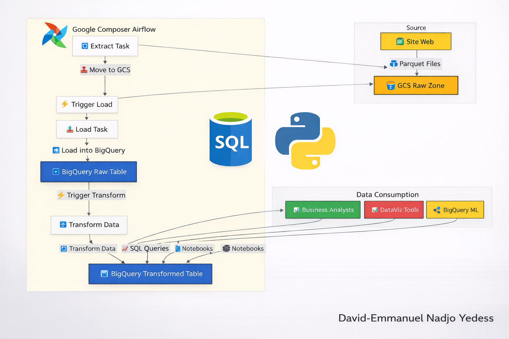
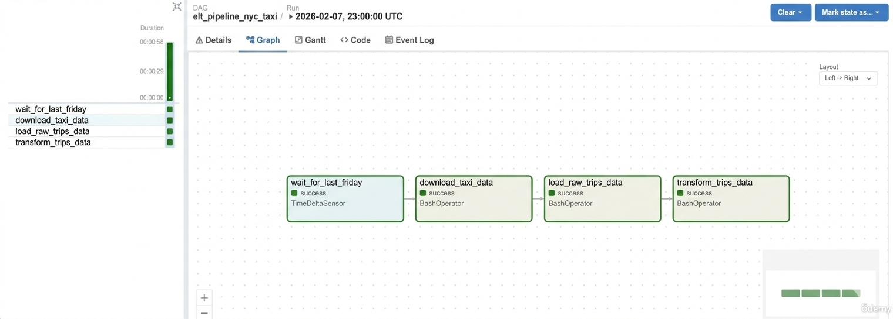
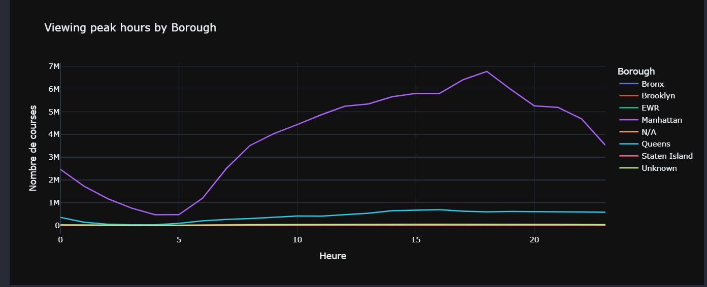
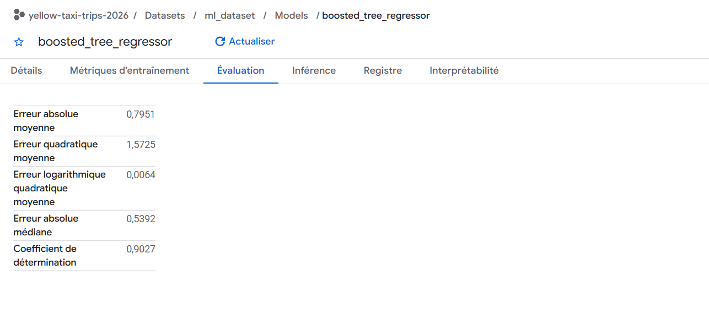
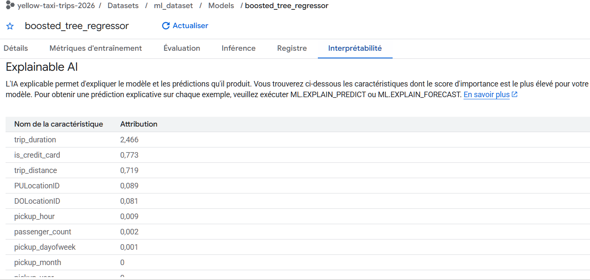

# 🚖 End-to-End Data Engineering & Analytics Platform on GCP
### NYC Yellow Taxi — ELT Pipeline, BI Analytics & Machine Learning

> **Positionnement Professionnel :** Ce projet démontre une maîtrise complète du cycle de vie de la donnée (Modern Data Stack) : du pipeline ELT orchestré à la modélisation prédictive. 
> *Cible : BI/Analytics Engineer (Junior).*

---

## 📌 Présentation du Projet
L'objectif de cette plateforme est d'analyser et de prédire la performance des trajets de taxis New-Yorkais (3M+ de lignes). J'ai conçu une architecture **Cloud-Native** évolutive permettant de transformer des données brutes en insights business et en modèles de Machine Learning.

### Points forts :
- **Architecture Médaillon :** Raw -> Transformed -> Analytics -> ML.
- **Approche Hybride :** Preprocessing via Python/Pandas et entraînement via BigQuery ML (Scalabilité).
- **Orchestration :** Flux automatisés via Apache Airflow (Cloud Composer).

---

## 🏗️ Architecture Technique

- **Ingestion :** Python SDK -> Google Cloud Storage (Bucket GCS).
- **Stockage & Warehouse :** BigQuery.
- **Orchestration :** Cloud Composer (Airflow).
- **Analytics :** SQL & Visualisation Plotly.
- **Machine Learning :** BigQuery ML (Boosted Tree Regressor).

---

## ⚙️ Couches du Projet 

### 1️⃣ Data Engineering & ELT

- **Ingestion :** Logique d'ingestion idempotente avec gestion des logs centralisée sur GCS.
- **Chargement (load):** Chargement des données brutes GCS vers BigQuery (raw_yellowtrips) 
- **Transformation :** Nettoyage des anomalies (transformed_data), standardisation des features et création de vues analytiques (views_fordashboard).
- **Orchestration :** DAG Airflow (elt_dag_pipeline_nyc_taxi) avec planification complexe (dernier vendredi du mois) et gestion de la résilience.

### 2️⃣ Analytics & Business Intelligence

Analyse multidimensionnelle via SQL et Plotly :
- **Marché :** Pics de demande et concentration géographique.
- **Finances :** Analyse de la tarification et comportement de paiement.
- **Opérations :** Efficacité des trajets (Duration vs Distance).

### 3️⃣ Machine Learning (BQML)

Prédiction du montant total des courses (`total_amount`).

*Note : L'analyse d'importance des features montre que la durée du trajet prévaut sur la distance.*
- **Feature Engineering :** Création de variables temporelles (heure, jour, week-end) et comportementales (type de carte).
- **Performance du Modèle :**
  - **R² Score : 0.9068** (90,7% de précision).
  - **MAE : 0.80$** (Erreur moyenne de 80 cents).
- **Explainable AI (XAI) :** La `trip_duration` est identifiée comme le principal facteur d'influence, devant la distance, soulignant l'impact du trafic urbain.

---

## 📂 Structure du Repository
- `01_data_ingestion & loading/` : Scripts Python d'import vers GCS.
- `02_bigquery_transformations/` : Scripts Python/SQL de nettoyage et vues.
- `03_airflow_dag/` : Orchestration du pipeline.
- `04_analytics/` : Notebooks d'analyse et graphiques Plotly.
- `05_machine_learning/` : Preprocessing Python et modèles BQML.
- `architecture/` : Schémas et documentation technique.

=======
## Note : les graphiques interactifs Plotly sont mieux visualisées en les téléchargeant ou avec nbviewer. 

## ELT avec BigQuery, GCS, Airflow, Python et SQL - Projet réel sur GCP, de l'ingestion des données au Machine Learning.

## (Complete GCP pipeline and ML model structure) 
